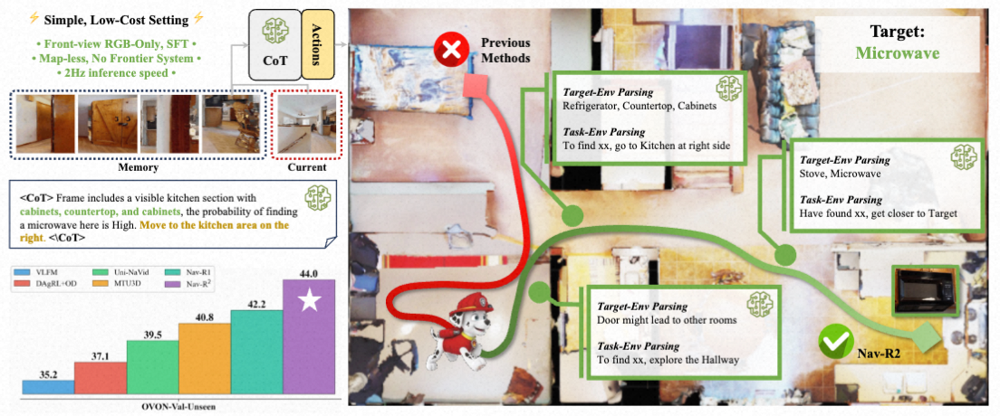
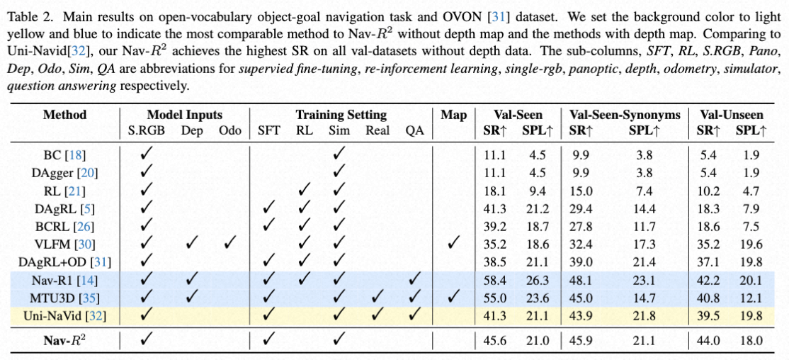
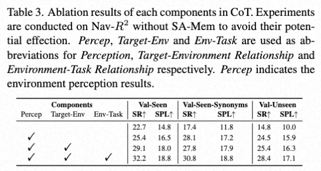
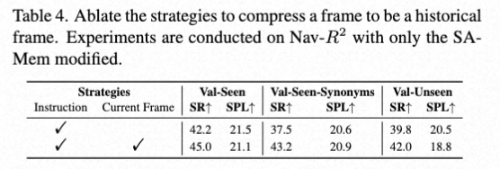
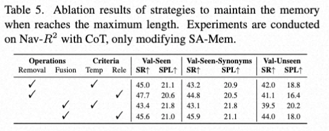

# Nav-R2

<!-- [](https://arxiv.org/abs/) -->
Official Implementation of paper: \
```Nav-R2:Dual‑Relation Reasoning for Generalizable Open‑Vocabulary Object‑Goal Navigation```


## Table of Contents

- [Overview](#overview)
  - [Pipeline and Structure](#pipeline-and-structure)
  - [Abstract](#abstract)
  - [Contributions](#contributions)
  - [Results on OVON](#results-on-ovon)
  - [Ablation Study](#ablation-study)
    - [Components in CoT](#components-in-cot)
    - [Memory Compression Strategy](#memory-compression-strategy)
    - [Memory Maintenance](#memory-maintenance)
- [Getting started with Nav-R2](#getting-started-with-nav-r2)
  - [**Datasets Preparation**](#datasets-preparation)
    - [Textual Dataset](#textual-dataset)
    - [Image Dataset](#image-dataset)
  - [**Model Weight**](#model-weight)
  - [**Training**](#training)
  - [**Evaluation**](#evaluation)


<p align="center">
 
</p>
<p align="center">
 
</p>

## Overview
### Pipeline and Structure
<p align="center">
 
</p>

### Abstract
Object-goal navigation in open-vocabulary settings requires agents to locate novel objects in unseen environments, yet existing approaches suffer from opaque decision-making processes and low success rate on locating unseen objects.
To address these challenges, we propose Nav-R2, a framework that explicitly models two critical types of relationships, target-environment modeling and environment-action planning, through structured Chain-of-Thought (CoT) reasoning coupled with a Similarity-Aware Memory.
We construct a Nav$R^2$-CoT dataset that teaches the model to perceive the environment, focus on target-related objects in the surrounding context and finally make future action plans.
Our SA-Mem preserves the most target-relevant and current observation-relevant features from both temporal and semantic perspectives by compressing video frames and fusing historical observations, while introducing no additional parameters.
Compared to previous methods, Nav-R2 achieves state-of-the-art performance in localizing unseen objects through a streamlined and efficient pipeline, avoiding overfitting to seen object categories while maintaining real-time inference at 2Hz.

### Contributions
(1) A relational reasoning framework for object-goal navigation that explicitly models the **target-environment** (perception) and **environment–action**(planning) relationships, integrating this structured reasoning in a streamlined pipeline without introducing additional model parameters.

(2) A novel Chain-of-Thought dataset specifically designed for training a generalizable object-goal navigation model capable of reasoning and modeling both two relationships.

(3) A vision-language reasoning model, Nav-R2, just trained via supervised fine-tuning on first-person RGB frames, achieving state-of-the-art performance in open-vocabulary ObjectNav and real-time inference at around 2Hz.

### Results on OVON
Here shows the results on OVON dataset. Nav-R2 is trained via **ONLY SFT** receiving **ONLY RGB observations** from **ONLY first-person view**, and achieves the best SR on the val-unseen split. 
<p align="center">
 
</p>

| Method       | S.RGB | Dep | Odo | SFT | RL | Sim | Real | QA | Map | SR ↑ (Val-Seen) | SPL ↑ (Val-Seen) | SR ↑ (Val-Seen-Synonyms) | SPL ↑ (Val-Seen-Synonyms) | SR ↑ (Val-Unseen) | SPL ↑ (Val-Unseen) |
|--------------|-------|-----|-----|-----|----|-----|------|----|-----|-----------------|------------------|-------------------------|--------------------------|-------------------|--------------------|
| BC           | ✔     |     |     |     |    | ✔   |      |    |     | 11.1            | 4.5              | 9.9                     | 3.8                      | 5.4               | 1.9                |
| DAgger       | ✔     |     |     |     |    | ✔   |      |    |     | 11.1            | 4.5              | 9.9                     | 3.8                      | 5.4               | 1.9                |
| RL           | ✔     |     |     |     | ✔  | ✔   |      |    |     | 18.1            | 9.4              | 15.0                    | 7.4                      | 10.2              | 4.7                |
| DAgRL        | ✔     |     |     | ✔   | ✔  | ✔   |      |    |     | 41.3            | 21.2             | 29.4                    | 14.4                     | 18.3              | 7.9                |
| BCRL         | ✔     |     |     | ✔   | ✔  | ✔   |      |    |     | 39.2            | 18.7             | 27.8                    | 11.7                     | 18.6              | 7.5                |
| VLFM         | ✔     | ✔   | ✔   |     | ✔  | ✔   |      |    | ✔   | 35.2            | 18.6             | 32.4                    | 17.3                     | 35.2              | 19.6               |
| DAgRL+OD     | ✔     |     |     | ✔   | ✔  | ✔   |      |    |     | 38.5            | 21.1             | 39.0                    | 21.4                     | 37.1              | 19.8               |
| Nav-R1       | ✔     | ✔   |     | ✔   | ✔  | ✔   |      | ✔  |     | 58.4            | 26.3             | 48.1                    | 23.1                     | 42.2              | 20.1               |
| MTU3D        | ✔     | ✔   |     | ✔   |    | ✔   | ✔    | ✔  | ✔   | 55.0            | 23.6             | 45.0                    | 14.7                     | 40.8              | 12.1               |
| Uni-NaVid    | ✔     |     |     | ✔   |    | ✔   | ✔    | ✔  |     | 41.3            | 21.1             | 43.9                    | 21.8                     | 39.5              | 19.8               |
| **Nav-R2**     | ✔     |     |     | ✔   |    | ✔   |      |    |     | 45.6            | 21.0             | 45.9                    | 21.1                     | 44.0              | 18.0               |

### Ablation Study
#### Components in CoT
<p align="center">
 
</p>

| Percep | Target-Env | Env-Task | SR ↑ (Val-Seen) | SPL ↑ (Val-Seen) | SR ↑ (Val-Seen-Synonyms) | SPL ↑ (Val-Seen-Synonyms) | SR ↑ (Val-Unseen) | SPL ↑ (Val-Unseen) |
|--------|------------|----------|-----------------|------------------|-------------------------|--------------------------|-------------------|--------------------|
|        |            |          | 22.7            | 14.8             | 17.4                    | 11.8                     | 14.8              | 10.0               |
| ✔      |            |          | 25.4            | 16.5             | 28.1                    | 17.2                     | 24.5              | 15.9               |
| ✔      | ✔          |          | 29.1            | 18.0             | 27.8                    | 17.9                     | 25.4              | 16.3               |
| ✔      | ✔          | ✔        | 32.2            | 18.8             | 30.8                    | 18.8                     | 28.4              | 17.1               |

#### Memory Compression Strategy
<p align="center">
 
</p>

| Instruction | Current Frame | SR ↑ (Val-Seen) | SPL ↑ (Val-Seen) | SR ↑ (Val-Seen-Synonyms) | SPL ↑ (Val-Seen-Synonyms) | SR ↑ (Val-Unseen) | SPL ↑ (Val-Unseen) |
|-------------|---------------|-----------------|------------------|-------------------------|--------------------------|-------------------|--------------------|
| ✔           |               | 42.2            | 21.5             | 37.5                    | 20.6                     | 39.8              | 20.5               |
| ✔           | ✔             | 45.0            | 21.1             | 43.2                    | 20.9                     | 42.0              | 18.8               |


#### Memory Maintenance
<p align="center">
 
</p>

| Removal | Fusion | Temp | Rele | SR ↑ (Val-Seen) | SPL ↑ (Val-Seen) | SR ↑ (Val-Seen-Synonyms) | SPL ↑ (Val-Seen-Synonyms) | SR ↑ (Val-Unseen) | SPL ↑ (Val-Unseen) |
|---------|--------|------|------|-----------------|------------------|-------------------------|--------------------------|-------------------|--------------------|
| ✔       |        | ✔    |      | 45.0            | 21.1             | 43.2                    | 20.9                     | 42.0              | 18.8               |
| ✔       |        |      | ✔    | 47.7            | 20.6             | 44.8                    | 20.5                     | 41.1              | 16.4               |
|         | ✔      | ✔    |      | 43.4            | 21.8             | 43.1                    | 21.8                     | 39.5              | 20.2               |
|         | ✔      |      | ✔    | 45.6            | 21.0             | 45.9                    | 21.1                     | 44.0              | 18.0               |

## Getting started with Nav-R2

### **Datasets Preparation**:
#### Textual Dataset
Our OVON text dataset with reasoning content can be downloaded at: \
(1) [Huggingface](https://huggingface.co/datasets/Chrono666/Nav-R2-OVON-CoT-Dataset) \
(2) [aDrive(coming)]()

#### Image Dataset
1. The complete expert trajectory data(frame-by-frame images, frame-by-frame action names and so on) collected based on the OVON dataset from Habitat can be downloaded from the link below: \
(1) [ModelScope](https://www.modelscope.ai/datasets/XiangWentao666/Nav-R2-OVON-Expert-Trajectory-Images/files) \
(2) [BaiduNetDisk(Uploading)](https://pan.baidu.com/s/12AJQ5TFq9fQCniJ-wC-hRg?pwd=6666) 
2. Place all the archives downloaded to an empty folder named ```data``` or anything else you want.
3. Execute ```cd data``` to enter the ```data``` folder.
4. Unzip each zip file to current location directly through command ```unzip <ZIP-FILE-NAME> -d .``` Supposing current zip file is ```00434-L5QEsaVqwrY.zip``` and the directory starting from ```data``` folder after operation ```unzip``` should be ```data/objectnav_ovon/objectnav_ovon/00434-L5QEsaVqwrY```
5. Currently we should be in the ```data``` folder, and please execute the following commands:\
```mv ./objectnav_ovon ./objectnav_ovon-to-delete``` \
```mv ./objectnav_ovon-to-delete/objectnav_ovon .``` \
```rm -r ./objectnav_ovon-to-delete```. 
6. Right now, the directory starting from ```data``` folder should be ```data/objectnav_ovon/00434-L5QEsaVqwrY```. 
7. In the textual dataset, image paths are declared as ```objectnav_ovon/00434-L5QEsaVqwrY/16997/shower_96_2.89938/052_move_forward_FrontView.png```. We should modify the textual dataset to replace all image paths with absolute paths on our training platform. \
Supposing the absolute path to our ```data``` folder is ```/a/b/c/data```, and the path to our ```Textual Dataset``` is ```/a/b/c/Nav-R2-OVON-dataset-20251126-1.json```, then the absolute path to one of the trajectory image files might be ```/a/b/c/data/objectnav_ovon/00434-L5QEsaVqwrY/16997/shower_96_2.89938/052_move_forward_FrontView.png```. Next, we should execute 
```shell
ABSOLUTE_PATH_TO_TEXTUAL_JSON_FILE="/a/b/c/Nav-R2-OVON-dataset-20251126-1.json" # replace "/a/b/c" when needed
ABSOLUTE_PATH_TO_TEXTUAL_JSON_FILE_BACKUP="/a/b/c/Nav-R2-OVON-dataset-20251126-1.json-backup" # replace "/a/b/c" when needed
cp ${ABSOLUTE_PATH_TO_TEXTUAL_JSON_FILE} ${ABSOLUTE_PATH_TO_TEXTUAL_JSON_FILE_BACKUP}
OLD_STRING="objectnav_ovon/"
NEW_STRING="/a/b/c/data/objectnav_ovon/" # replace "/a/b/c" when needed
sed -i "s|${OLD_STRING}|${NEW_STRING}|g" ${ABSOLUTE_PATH_TO_TEXTUAL_JSON_FILE}
```

### **Model Weight**:
Pretrained Nav-R2 model weights can be downloaded at: \
(1) [Huggingface](https://huggingface.co/Chrono666/Nav-R2) \
(2) [aDrive(coming soon)]()

### **Training**:
#### (1) Install conda environment following
```conda create -n Nav-R2-training``` \
```conda activate Nav-R2-training``` \
```pip install -r requirements-for-training.txt```

**Attention:** \
three libraries should be installed from source files in the environment-modules-customed folder: \
```transformers```, ```trl```, and ```flash_attn```
#### (2) Install extra libraries
```pip install -e environment-modules-customed/transformers_4.51.3-xwt-customed/transformers``` \
```pip install environment-modules-customed/flash_attn-2.7.4.post1+cu12torch2.6cxx11abiTRUE-cp310-cp310-linux_x86_64.whl``` \
```pip install environment-modules-customed/trl```
#### (3) Start Training
To start training, use ms-swift framework and apply our modifications to the framework, then run through a shell script(switch running command to torchrun when it is needed like run in a distributed mode):
```shell
model_path=""
data_path="/a/b/c/Nav-R2-OVON-dataset-20251126-1.json" # replace "/a/b/c" when needed
valid_data_path="" # any subset of training dataset is accepted
output_dir=""

current_img_num=1
deepspeed_strategy=zero2

per_device_train_batch_size=4  
gradient_accumulation_steps=1

num_train_epochs=1  
save_steps=1111111111 # do not save checkpoints during training for a faster training.
learning_rate=2e-4  

resize_history_img=true
use_StdTemplateInputs_Customed_by_XWT=true
is_on_PAI=false # not important but can not be None or absent

args="--model $model_path \
    --deepspeed ${deepspeed_strategy} \
    --dataset $data_path \
    --val_dataset $valid_data_path \
    --num_train_epochs ${num_train_epochs} \
    --per_device_train_batch_size ${per_device_train_batch_size} \
    --gradient_accumulation_steps ${gradient_accumulation_steps} \
    --current_img_num ${current_img_num} \
    --save_steps ${save_steps} \
    --output_dir $output_dir \
    --train_type full \
    --torch_dtype bfloat16 \
    --freeze_aligner false \
    --per_device_eval_batch_size 1 \
    --lazy_tokenize true \
    --learning_rate ${learning_rate} \
    --split_dataset_ratio 0.0 \
    --dataset_num_proc 32 \
    --truncation_strategy delete \
    --fix_img_width 640 \
    --fix_img_height 520 \
    --added_special_tokens special_tokens.txt \
    --resize_history_img ${resize_history_img} \
    --freeze_vit true \
    --logging_steps 5 \
    --max_length 6096 \
    --lr_scheduler_type cosine \
    --warmup_ratio 0.05 \
    --add_version \
    --remove_unused_columns false \
    --is_on_PAI ${is_on_PAI} \
    --use_StdTemplateInputs_Customed_by_XWT ${use_StdTemplateInputs_Customed_by_XWT} \
    --attn_impl flash_attn" \
python swift/cli/sft.py ${args}
```

### **Evaluation**: 
#### (1) Install conda environment following steps below:
```shell
conda create -n Nav-R2-evaluation python=3.9.19 
conda activate Nav-R2-evaluation
pip install -r requirements-for-evaluation-on-OVON.txt
```
**Attention:** \
four libraries should be installed from source files in the environment-modules-customed folder: \
```flash_attn```, ```transformers```, ```habitat_lab```, and ```habitat-baseline```

#### (2) Install extra libraries:
Install flash_attn: \
```pip install environment-modules-customed/flash_attn-2.7.4.post1+cu12torch2.6cxx11abiTRUE-cp310-cp310-linux_x86_64.whl```

Next, please install ```transformers``` **first**, **then** ```habitat_lab```, and **finally** ```habitat-baseline```:

```shell
pip install -e environment-modules-customed/transformers_4.51.3-xwt-customed/transformers

pip install -e environment-modules-customed/habitat-related/ovon/habitat-lab

pip install -e environment-modules-customed/habitat-related/ovon/habitat-baselines
```

#### (3) Prepare dataset
- HM3D-OVON dataset can be downloaded at [ModelScope](https://www.modelscope.ai/datasets/XiangWentao666/Nav-R2-hm3d-ovon/files)
- HM3D-scenes_dir dataset can be downloaded at [ModelScope](https://www.modelscope.ai/datasets/XiangWentao666/Nav-R2-hm3d-scenes-dir/files)
- Unzip the two archives above. Then the ```/path-scenes_dir``` and ```/path-to-hm3d_ovon``` at the following step are related to the absolute paths of HM3D-scenes_dir and HM3D-OVON respectively.

#### (4) Modify configuration file
Locate file at ```Nav-R2-evaluation-ovon/ovon/configs/ovon_citywalker_front_view_only.yaml```, and then comment/uncomment the correct code block in the file as follows(replace the absolute paths: ```scenes_dir``` and ```data_path```)
```yaml
# val-unseen
habitat:
    xxxx:
        xxx
    dataset:
        type: "OVON-v1"
        split: "val_unseen"
        scenes_dir: "/path-scenes_dir/hm3d-scenes_dir"

        content_scenes: ["*"]
        data_path: "/path-to-hm3d_ovon/hm3d/hm3d/val_unseen/val_unseen_hard.json.gz"
```
```yaml
# val-seen-synonyms
habitat:
    xxxx:
        xxx
    dataset:
        type: "OVON-v1"             
        split: "val_seen_synonyms" 
        scenes_dir: "/path-scenes_dir/hm3d-scenes_dir"

        content_scenes: ["*"]
        data_path: "/path-to-hm3d_ovon/hm3d/hm3d/val_seen_synonyms/val_unseen_easy.json.gz"
```

```yaml
# val-seen
habitat:
    xxxx:
        xxx
    dataset:
        type: "OVON-v1"
        split: "NOT-USED-BY_CODE"
        scenes_dir: "/path-scenes_dir/hm3d-scenes_dir"
        content_scenes: ["*"]
        data_path: "/path-to-hm3d_ovon/hm3d/hm3d/val_seen/val_seen.json.gz"
```

#### (5) Start evaluation:
Run the following commands, and the arguments of the command with a shell file mean ```the GPU ids``` and ```whether run for debug, 1 for debug mode```
```shell
cd Nav-R2-evaluation-ovon
./eval_citywalker_ovon.sh 0,1,2,3,4,5 # for running in a parallel way on multiple gpus 
./eval_citywalker_ovon.sh 0,1,2,3,4,5 1 # for debug using only one gpu
```
