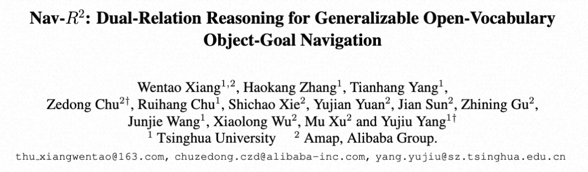
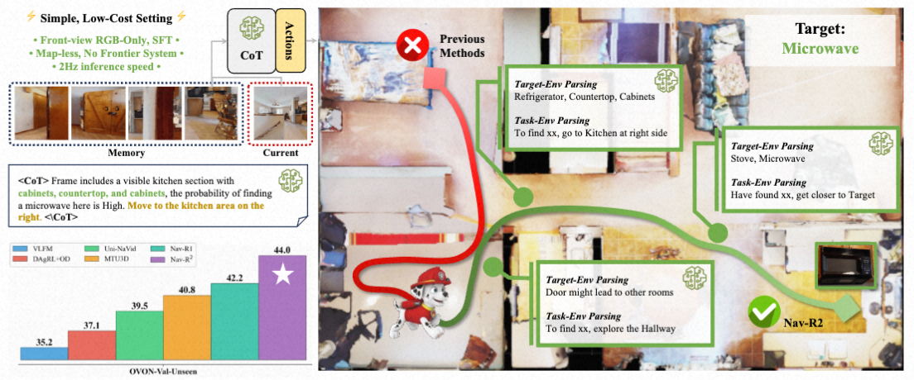
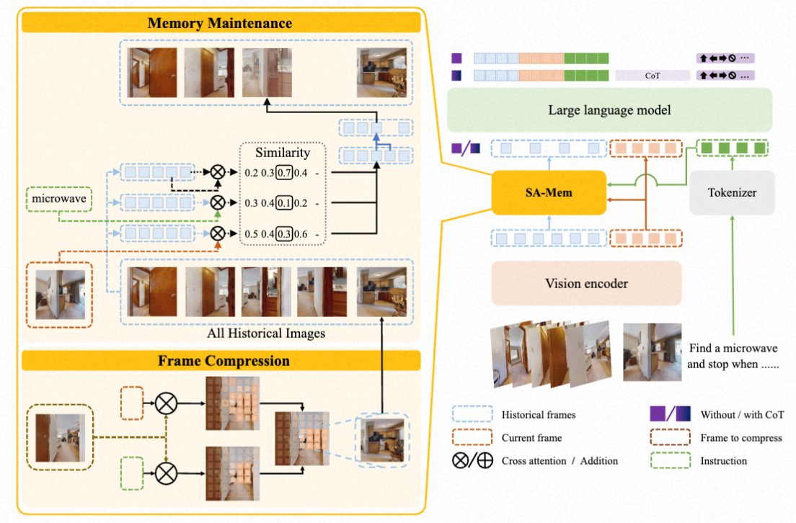
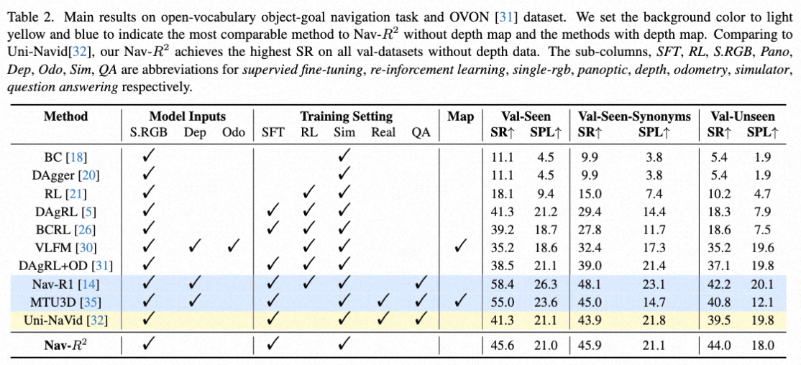
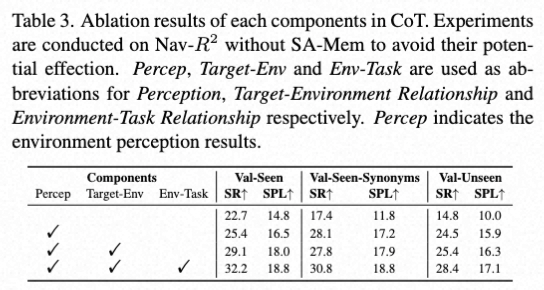
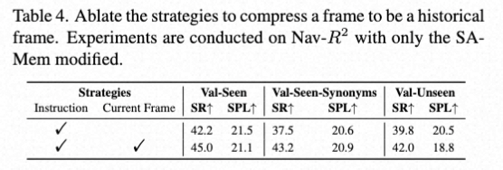
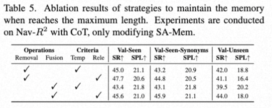

# 

# Nav-R2
<!-- [](https://arxiv.org/abs/) -->
Official Implementation of paper: ```Nav-R2:Dual‑Relation Reasoning for Generalizable Open‑Vocabulary Object‑Goal Navigation```
<p align="center">
 
</p>

## Overview
### Teaser
<p align="center">
 
</p>

### Pipeline and Structure
<p align="center">
 
</p>

## Abstract
Object-goal navigation in open-vocabulary settings requires agents to locate novel objects in unseen environments, yet existing approaches suffer from opaque decision-making processes and low success rate on locating unseen objects.
To address these challenges, we propose Nav-R2, a framework that explicitly models two critical types of relationships, target-environment modeling and environment-action planning, through structured Chain-of-Thought (CoT) reasoning coupled with a Similarity-Aware Memory.
We construct a Nav$R^2$-CoT dataset that teaches the model to perceive the environment, focus on target-related objects in the surrounding context and finally make future action plans.
Our SA-Mem preserves the most target-relevant and current observation-relevant features from both temporal and semantic perspectives by compressing video frames and fusing historical observations, while introducing no additional parameters.
Compared to previous methods, Nav-R2 achieves state-of-the-art performance in localizing unseen objects through a streamlined and efficient pipeline, avoiding overfitting to seen object categories while maintaining real-time inference at 2Hz.

## Contributions
(1) A relational reasoning framework for object-goal navigation that explicitly models the **target-environment** (perception) and **environment–action**(planning) relationships, integrating this structured reasoning in a streamlined pipeline without introducing additional model parameters.

(2) A novel Chain-of-Thought dataset specifically designed for training a generalizable object-goal navigation model capable of reasoning and modeling both two relationships.

(3) A vision-language reasoning model, Nav-R2, just trained via supervised fine-tuning on first-person RGB frames, achieving state-of-the-art performance in open-vocabulary ObjectNav and real-time inference at around 2Hz.

## Getting started with Nav-R2

### **Training**:
#### (1) Install conda environment following
```conda create -n Nav-R2-training``` \
```pip install -r requirements-for-training.txt```

**Attention:** \
three libraries should be installed from source files in the environment-modules-customed folder: \
transformers, trl, and flash_attn \
#### (2) Install extra libraries
```pip install -e environment-modules-customed/transformers_4.51.3-xwt-customed/transformers``` \
```pip install environment-modules-customed/flash_attn-2.7.4.post1+cu12torch2.6cxx11abiTRUE-cp310-cp310-linux_x86_64.whl``` \
```pip install environment-modules-customed/trl``` \
#### (3) Strat Training
To start training, use ms-swift framework and apply our modifications to the framework, then run through a shell script(switch running command to torchrun when it is needed like run in a distributed mode):
```shell
model_path=""
data_path=""
valid_data_path=""
output_dir=""

current_img_num=1
deepspeed_strategy=zero2

per_device_train_batch_size=4  
gradient_accumulation_steps=1

num_train_epochs=1  
save_steps=1111111111
learning_rate=2e-4  

resize_history_img=true
use_StdTemplateInputs_Customed_by_XWT=true
is_on_PAI=false

args="--model $model_path \
    --deepspeed ${deepspeed_strategy} \
    --dataset $data_path \
    --val_dataset $valid_data_path \
    --num_train_epochs ${num_train_epochs} \
    --per_device_train_batch_size ${per_device_train_batch_size} \
    --gradient_accumulation_steps ${gradient_accumulation_steps} \
    --current_img_num ${current_img_num} \
    --save_steps ${save_steps} \
    --output_dir $output_dir \
    --train_type full \
    --torch_dtype bfloat16 \
    --freeze_aligner false \
    --per_device_eval_batch_size 1 \
    --lazy_tokenize true \
    --learning_rate ${learning_rate} \
    --split_dataset_ratio 0.0 \
    --dataset_num_proc 32 \
    --truncation_strategy delete \
    --fix_img_width 640 \
    --fix_img_height 520 \
    --added_special_tokens special_tokens.txt \
    --resize_history_img ${resize_history_img} \
    --freeze_vit true \
    --logging_steps 5 \
    --max_length 6096 \
    --lr_scheduler_type cosine \
    --warmup_ratio 0.05 \
    --add_version \
    --remove_unused_columns false \
    --is_on_PAI ${is_on_PAI} \
    --use_StdTemplateInputs_Customed_by_XWT ${use_StdTemplateInputs_Customed_by_XWT} \
    --attn_impl flash_attn" \
python swift/cli/sft.py ${args}
```

### **Evaluation**: 
#### (1) Install conda environment following steps below:
```shell
conda create -n Nav-R2-evaluation python=3.9.19
pip install -r requirements-for-evaluation-on-OVON.txt
```

**Attention:** \
four libraries should be installed from source files in the environment-modules-customed folder: \
flash_attn, transformers, habitat_lab, and habitat-baseline:

#### (2) Install extra libraries:
Install flash_attn: \
```pip install environment-modules-customed/flash_attn-2.7.4.post1+cu12torch2.6cxx11abiTRUE-cp310-cp310-linux_x86_64.whl```

Next, please install transformers first, then habitat_lab, finally habitat-baseline:

```pip install -e environment-modules-customed/transformers_4.51.3-xwt-customed/transformers``` \
```pip install -e environment-modules-customed/habitat-related/habitat-lab``` \
```pip install -e environment-modules-customed/habitat-related/habitat-baselines```


### **Datasets**:
Dataset can be downloaded at: \
(1) [Huggingface](https://huggingface.co/datasets/Chrono666/Nav-R2-OVON-CoT-Dataset) \
(2) [aDrive(coming)]()

### **Model Weight**: \
Pretrained Nav-R2 model weights can be downloaded at: \
(1) [Huggingface](https://huggingface.co/Chrono666/Nav-R2) \
(2) [aDrive(coming)]()


## Results on OVON
Here shows the results on OVON dataset. Nav-R2 is trained via **ONLY SFT** receiving **ONLY RGB observations** from **ONLY first-person view**, and achieves the best SR on the val-unseen split. 
<p align="center">
 
</p>

## Ablation Study
### Components in CoT
<p align="center">
 
</p>

### Memory Compression Strategy
<p align="center">
 
</p>

### Memory Maintenance
<p align="center">
 
</p>

